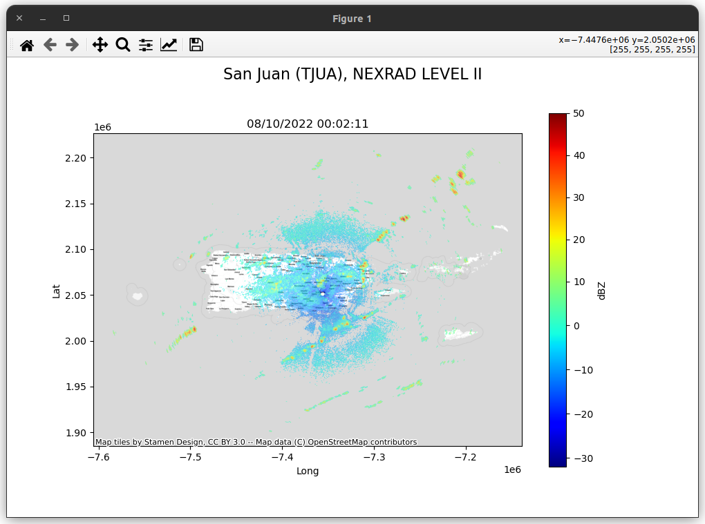

# Doppler Radar Visualization
An example of visualization Doppler Radar Data. The data used here is KAMX (Miami) Doppler Radar data (0.5 degree base velocity). The data provided by NOAA and can be accessed from this web page: https://www.ncdc.noaa.gov/nexradinv/

I provided two types of data visualization with two different libraries used (matplotlib and plotly).

## The results

 
