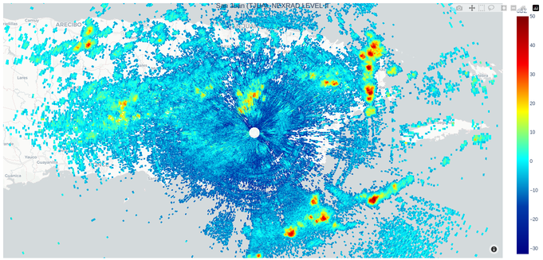

# Doppler Radar Visualization
An example of visualization Doppler Radar Data. The data used here is TJUA (San Juan, Puerto Rico) Doppler Radar data Level 2 (0.48 degree). The data provided by NOAA and can be accessed from this web page: https://s3.amazonaws.com/noaa-nexrad-level2/index.html

There are two types of data visualization with two different libraries used (matplotlib and plotly).

## The results

 

